# 二次压降检测系统 - 问题记录与解答

> 本文档记录项目开发过程中的常见问题及解答，包括系统架构、数据库设计等核心问题。
> 持续更新中...

---

## 目录

- [Q1: 系统架构图](#q1-系统架构图)
- [Q2: 数据库E-R图](#q2-数据库e-r图)
- [Q3: 功能模块设计与实现](#q3-功能模块设计与实现)
- [Q4: 模块五 - 安全设计](#q4-模块五---安全设计)
  - [5.1 前后端分离架构与技术栈](#51-前后端分离架构与技术栈)
  - [5.2 通信协议与接口规范](#52-通信协议与接口规范)
  - [5.3 认证授权流程详解](#53-认证授权流程详解)
  - [5.4 Token机制详解](#54-token机制详解)
  - [5.5 异常处理机制](#55-异常处理机制)
  - [5.6 安全性最佳实践](#56-安全性最佳实践)
  - [5.7 安全设计总结](#57-安全设计总结)
- [持续更新中...](#持续更新中)

---

## Q1: 系统架构图

### 问题描述

> 给出这个系统的架构图

### 解答

二次压降检测系统采用**前后端分离的B/S架构**，后端使用Spring Boot框架，前端使用Vue.js，以下是完整的系统架构图：

### 系统整体架构图

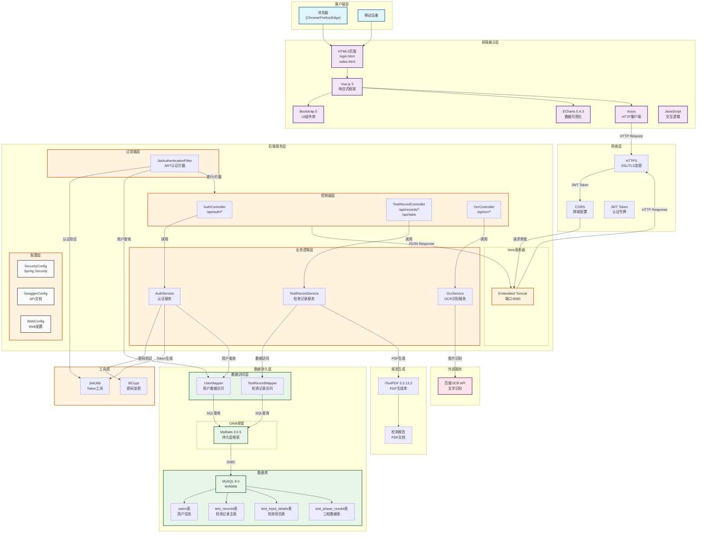

### 架构图详细说明

#### 请求处理流程

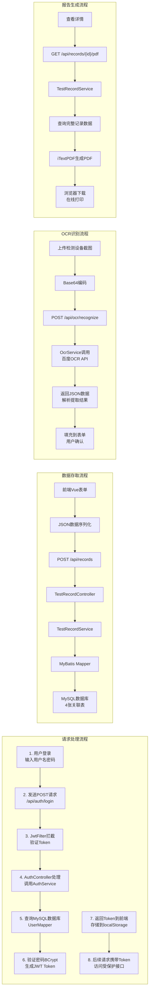

### 技术栈总结

| 层级 | 技术 | 说明 |
|------|------|------|
| **前端** | Vue.js 3 + Axios + Bootstrap 5 + ECharts | 前后端分离架构 |
| **后端** | Spring Boot 3.4.12 + Spring Security | 企业级框架 |
| **认证** | JWT (jjwt 0.12.6) + BCrypt | 无状态Token认证 |
| **持久层** | MyBatis 3.0.5 | 轻量级ORM |
| **数据库** | MySQL 8.0 | 关系型数据库 |
| **PDF** | iTextPDF 5.5.13.3 | PDF文档生成 |
| **OCR** | 百度OCR API | 文字图像识别 |
| **文档** | Swagger/OpenAPI | API接口文档 |

---

## Q2: 数据库E-R图

### 问题描述

> 给出数据库的E-R图

### 解答

### 数据库E-R图

```mermaid
erDiagram
    USERS ||--o{ TEST_RECORDS : "创建者关联"
    
    USERS {
        bigint id PK "用户ID"
        varchar(50) username UK "用户名"
        varchar(255) password "密码(BCrypt加密)"
        varchar(100) nickname "昵称"
        varchar(100) email "邮箱"
        varchar(20) phone "手机号"
        varchar(20) role "角色(USER/ADMIN)"
        int status "状态(1正常/0禁用)"
        datetime create_time "创建时间"
        datetime update_time "更新时间"
    }

    TEST_RECORDS ||--o{ TEST_INPUT_DETAILS : "包含"
    TEST_INPUT_DETAILS ||--o{ TEST_PHASE_RESULTS : "包含"
    
    TEST_RECORDS {
        bigint id PK "记录ID"
        varchar(100) product_no "产品编号"
        varchar(200) product_name "产品名称"
        varchar(200) manufacturer "制造商"
        varchar(200) origin "产地"
        date test_date "检测日期"
        varchar(50) secondary_voltage "二次电压"
        varchar(20) temperature "温度"
        varchar(20) humidity "湿度"
        varchar(20) result_status "结论(合格/不合格)"
        datetime create_time "创建时间"
        datetime update_time "更新时间"
    }

    TEST_INPUT_DETAILS {
        bigint id PK "详情ID"
        bigint record_id FK "关联记录ID"
        varchar(50) item_name "项目名称(PT1/PT2/CT1/CT2)"
        varchar(50) rating "档位"
        varchar(20) percentage "百分比"
        varchar(50) min_limit "下限"
        varchar(50) max_limit "上限"
        varchar(50) measured_val "实测值"
        varchar(50) secondary_voltage "二次电压"
        varchar(20) temperature "温度"
        varchar(20) humidity "湿度"
        varchar(20) result_status "结论"
        datetime create_time "创建时间"
    }

    TEST_PHASE_RESULTS {
        bigint id PK "相位结果ID"
        bigint record_id FK "关联记录ID"
        varchar(50) item_name FK "项目名称"
        varchar(10) phase "相位(ao/bo/co)"
        decimal(15,8) f_percent "比差f(%)"
        decimal(15,8) d_percent "角差d(分)"
        decimal(15,8) du_percent "压降误差dU(%)"
        decimal(15,8) uptu_percent "Upt:U比值"
        decimal(15,8) uybu_percent "Uyb:U比值"
        datetime create_time "创建时间"
    }
```

### 实体关系详解

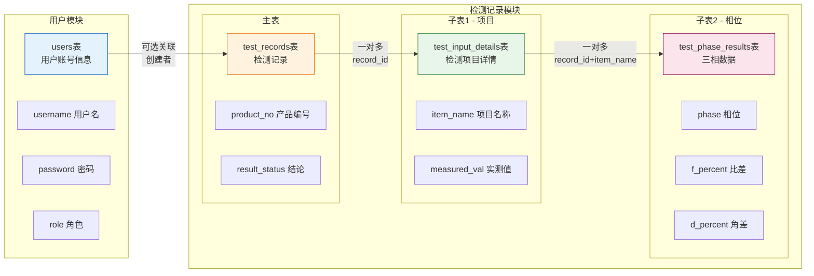

### 完整E-R关系图

```mermaid
flowchart TB
    subgraph 表结构
        subgraph Users["users<br/>(用户表)"]
            U_PK["🔑 id BIGINT<br/>PRIMARY KEY"]
            U_UN["🔐 username VARCHAR(50)<br/>UNIQUE, NOT NULL"]
            U_PWD["🔒 password VARCHAR(255)<br/>NOT NULL"]
            U_NICK["👤 nickname VARCHAR(100)"]
            U_EMAIL["📧 email VARCHAR(100)"]
            U_PHONE["📱 phone VARCHAR(20)"]
            U_ROLE["🎭 role VARCHAR(20)<br/>DEFAULT 'USER'"]
            U_STATUS["📊 status INT<br/>DEFAULT 1"]
            U_CT["🕐 create_time DATETIME"]
            U_UT["🕐 update_time DATETIME"]
        end

        subgraph TestRecords["test_records<br/>(检测记录主表)"]
            TR_PK["🔑 id BIGINT<br/>PRIMARY KEY"]
            TR_PNO["📋 product_no VARCHAR(100)<br/>NOT NULL, INDEX"]
            TR_PNAME["📦 product_name VARCHAR(200)"]
            TR_MFR["🏭 manufacturer VARCHAR(200)"]
            TR_ORIGIN["📍 origin VARCHAR(200)"]
            TR_DATE["📅 test_date DATE<br/>INDEX"]
            TR_VOLT["⚡ secondary_voltage VARCHAR(50)"]
            TR_TEMP["🌡️ temperature VARCHAR(20)"]
            TR_HUM["💧 humidity VARCHAR(20)"]
            TR_STATUS["✅ result_status VARCHAR(20)"]
            TR_CT["🕐 create_time DATETIME"]
            TR_UT["🕐 update_time DATETIME"]
        end

        subgraph TestInputDetails["test_input_details<br/>(检测项目详情表)"]
            TID_PK["🔑 id BIGINT<br/>PRIMARY KEY"]
            TID_RID["🔗 record_id BIGINT<br/>FOREIGN KEY → test_records.id"]
            TID_ITEM["📝 item_name VARCHAR(50)<br/>NOT NULL"]
            TID_RATING["⚙️ rating VARCHAR(50)"]
            TID_PCT["📊 percentage VARCHAR(20)"]
            TID_MIN["⬇️ min_limit VARCHAR(50)"]
            TID_MAX["⬆️ max_limit VARCHAR(50)"]
            TID_VAL["📏 measured_val VARCHAR(50)"]
            TID_VOLT["⚡ secondary_voltage VARCHAR(50)"]
            TID_TEMP["🌡️ temperature VARCHAR(20)"]
            TID_HUM["💧 humidity VARCHAR(20)"]
            TID_STATUS["✅ result_status VARCHAR(20)"]
            TID_CT["🕐 create_time DATETIME"]
        end

        subgraph TestPhaseResults["test_phase_results<br/>(三相误差结果表)"]
            TPR_PK["🔑 id BIGINT<br/>PRIMARY KEY"]
            TPR_RID["🔗 record_id BIGINT<br/>FOREIGN KEY → test_records.id"]
            TPR_ITEM["🔗 item_name VARCHAR(50)<br/>NOT NULL"]
            TPR_PHASE["📐 phase VARCHAR(10)<br/>ao/bo/co"]
            TPR_F["📈 f_percent DECIMAL(15,8)<br/>比差f(%)"]
            TPR_D["📉 d_percent DECIMAL(15,8)<br/>角差d(分)"]
            TPR_DU["📊 du_percent DECIMAL(15,8)<br/>压降误差dU(%)"]
            TPR_UPT["⚡ uptu_percent DECIMAL(15,8)<br/>Upt:U比值"]
            TPR_UYB["⚡ uybu_percent DECIMAL(15,8)<br/>Uyb:U比值"]
            TPR_CT["🕐 create_time DATETIME"]
        end
    end

    %% 关系连线
    TestRecords -->|"1:N<br/>ON DELETE CASCADE"| TestInputDetails
    TestRecords -->|"1:N<br/>ON DELETE CASCADE"| TestPhaseResults
    TestInputDetails -->|"1:N<br/>复合外键"| TestPhaseResults

    %% 样式
    style Users fill:#e3f2fd,stroke:#1565c0,stroke-width:3px
    style TestRecords fill:#fff3e0,stroke:#ef6c00,stroke-width:3px
    style TestInputDetails fill:#e8f5e9,stroke:#2e7d32,stroke-width:3px
    style TestPhaseResults fill:#fce4ec,stroke:#880e4f,stroke-width:3px
```

### 数据库约束说明

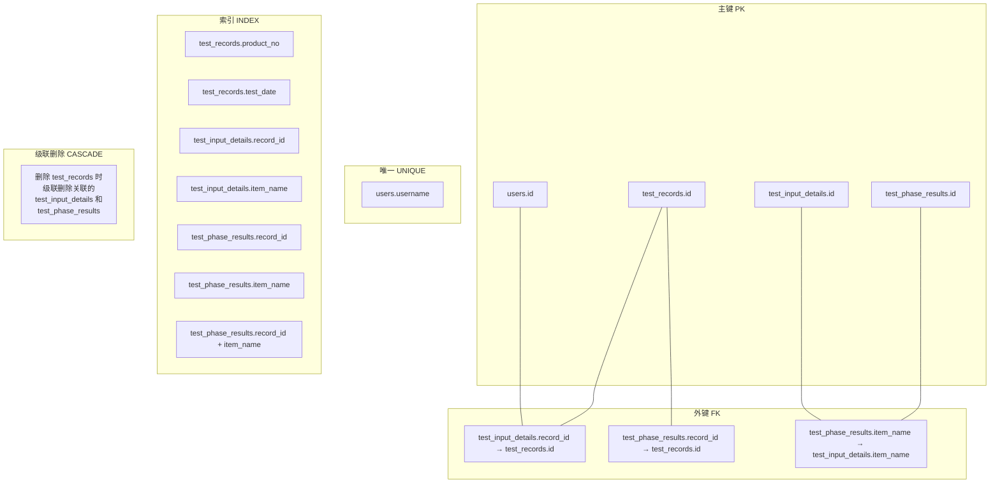

### 数据示例

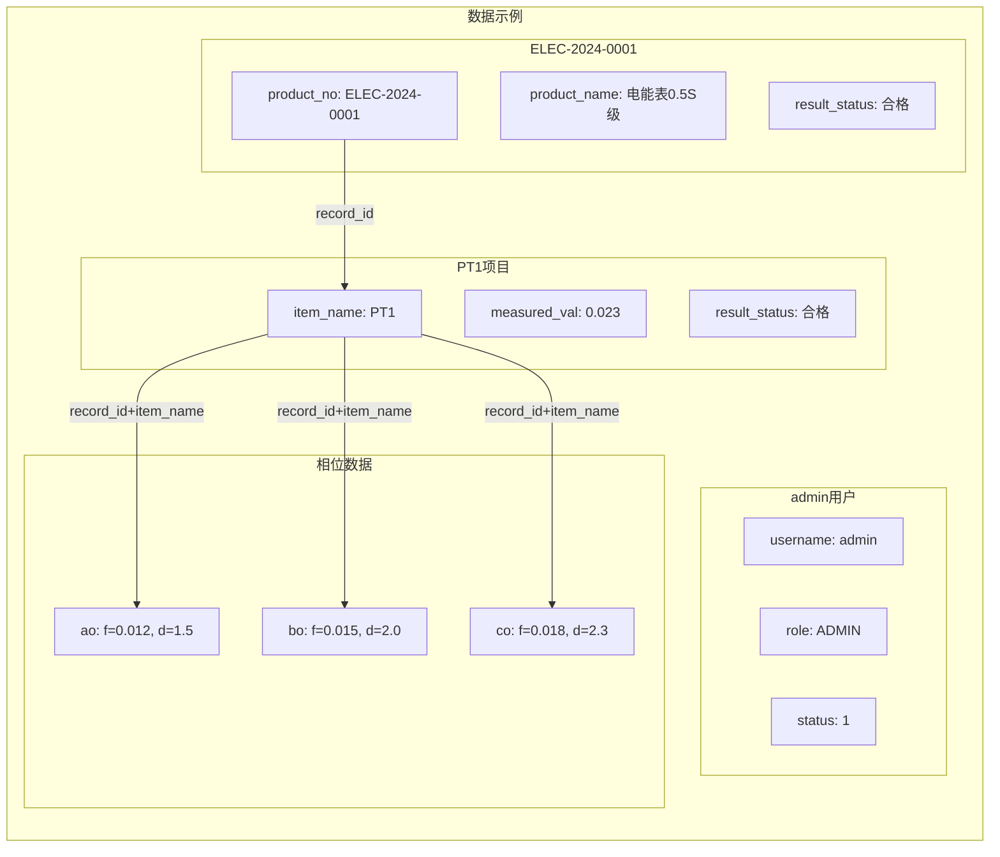

### 关键字段说明

| 表名 | 字段 | 数据类型 | 说明 | 示例 |
|------|------|----------|------|------|
| **users** | id | BIGINT | 主键，自增 | 1 |
| | username | VARCHAR(50) | 用户名，唯一 | "admin" |
| | password | VARCHAR(255) | BCrypt加密 | "$2a$10$..." |
| | role | VARCHAR(20) | 角色 | "USER"/"ADMIN" |
| **test_records** | id | BIGINT | 主键，自增 | 1 |
| | product_no | VARCHAR(100) | 产品编号 | "ELEC-2024-0001" |
| | result_status | VARCHAR(20) | 检测结论 | "合格"/"不合格" |
| | test_date | DATE | 检测日期 | "2024-01-05" |
| **test_input_details** | id | BIGINT | 主键，自增 | 1 |
| | record_id | BIGINT | 外键→test_records | 1 |
| | item_name | VARCHAR(50) | 项目名称 | "PT1"/"PT2"/"CT1" |
| | measured_val | VARCHAR(50) | 实测值 | "0.023" |
| **test_phase_results** | id | BIGINT | 主键，自增 | 1 |
| | record_id | BIGINT | 外键→test_records | 1 |
| | item_name | VARCHAR(50) | 项目名称 | "PT1" |
| | phase | VARCHAR(10) | 相位 | "ao"/"bo"/"co" |
| | f_percent | DECIMAL(15,8) | 比差(%) | 0.01200000 |
| | d_percent | DECIMAL(15,8) | 角差(分) | 1.50000000 |

---

## Q3: 功能模块设计与实现

### 问题描述

> 详细说明各功能模块的设计与实现，包括功能说明、实现逻辑和界面截图

### 解答

本系统包含7大核心功能模块，以下按 **前端操作 → 后端处理 → 结果展示** 的流程详细说明每个模块的实现。

---

### 3.1 用户认证授权模块

#### 功能说明

用户认证授权模块实现用户的注册、登录功能，采用JWT无状态Token认证机制，确保系统安全性。

#### 实现逻辑

用户认证授权模块采用JWT无状态Token认证机制，前端通过Axios拦截器在每个请求头中自动携带Token，后端通过JwtAuthenticationFilter过滤器验证Token有效性。登录时，前端发送用户名密码到后端AuthController，AuthService查询数据库验证用户身份，使用BCrypt算法比对密码，验证成功后生成包含用户名和角色的JWT Token返回给前端，前端将Token存储到localStorage。注册时，后端对密码进行BCrypt加密后存入数据库，同样生成Token返回。后续请求时，JwtAuthenticationFilter从Authorization请求头中提取Token，验证签名和有效期后设置Spring Security上下文，允许请求继续。

#### 处理流程图

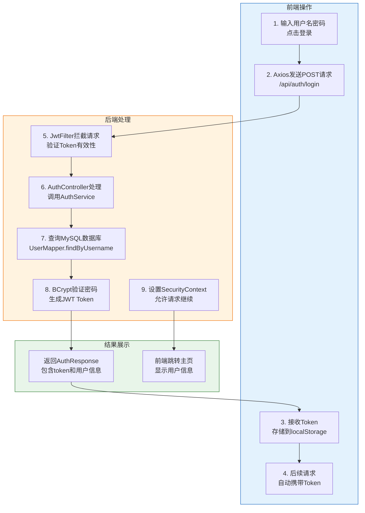

#### 前端关键代码

```javascript
// src/main/resources/static/login.html
async function handleLogin() {
    const username = document.getElementById('loginUsername').value;
    const password = document.getElementById('loginPassword').value;

    const response = await fetch('/api/auth/login', {
        method: 'POST',
        headers: { 'Content-Type': 'application/json' },
        body: JSON.stringify({ username, password })
    });

    const data = await response.json();
    
    if (data.token) {
        // 存储Token到localStorage
        localStorage.setItem('token', data.token);
        localStorage.setItem('username', data.username);
        localStorage.setItem('nickname', data.nickname);
        localStorage.setItem('role', data.role);
        
        // 跳转到主页
        window.location.href = '/index.html';
    }
}

// src/main/resources/static/index.html - Axios拦截器
axios.interceptors.request.use(config => {
    const token = localStorage.getItem('token');
    if (token) {
        config.headers.Authorization = 'Bearer ' + token;
    }
    return config;
});
```

#### 后端关键代码

```java
// AuthController.java
@RestController
@RequestMapping("/api/auth")
public class AuthController {
    @PostMapping("/login")
    public ResponseEntity<AuthResponse> login(@RequestBody LoginRequest request) {
        AuthResponse response = authService.login(request);
        return ResponseEntity.ok(response);
    }

    @PostMapping("/register")
    public ResponseEntity<AuthResponse> register(@RequestBody RegisterRequest request) {
        AuthResponse response = authService.register(request);
        return ResponseEntity.ok(response);
    }
}

// AuthService.java
@Service
public class AuthService {
    public AuthResponse login(LoginRequest request) {
        User user = userMapper.findByUsername(request.getUsername());
        
        if (user == null) return AuthResponse.error("用户不存在");
        if (user.getStatus() != 1) return AuthResponse.error("账号已被禁用");
        
        // BCrypt密码验证
        if (!passwordEncoder.matches(request.getPassword(), user.getPassword())) {
            return AuthResponse.error("密码错误");
        }
        
        // 生成JWT Token
        String token = jwtUtils.generateToken(user.getUsername(), user.getRole());
        return AuthResponse.success(token, user.getUsername(), user.getNickname(), user.getRole());
    }
}

// JwtAuthenticationFilter.java - Token验证过滤器
@Component
public class JwtAuthenticationFilter extends OncePerRequestFilter {
    @Override
    protected void doFilterInternal(HttpServletRequest request, 
                                    HttpServletResponse response, 
                                    FilterChain filterChain) {
        String authHeader = request.getHeader("Authorization");
        
        if (authHeader != null && authHeader.startsWith("Bearer ")) {
            String token = authHeader.substring(7);
            
            if (jwtUtils.validateToken(token)) {
                String username = jwtUtils.getUsernameFromToken(token);
                User user = userMapper.findByUsername(username);
                
                if (user != null && user.getStatus() == 1) {
                    UsernamePasswordAuthenticationToken authentication =
                        new UsernamePasswordAuthenticationToken(
                            user, null, 
                            Collections.singletonList(new SimpleGrantedAuthority("ROLE_" + user.getRole()))
                        );
                    SecurityContextHolder.getContext().setAuthentication(authentication);
                }
            }
        }
        
        filterChain.doFilter(request, response);
    }
}
```

#### 界面截图说明

```
┌─────────────────────────────────────────────────────────────┐
│                    登录页面 (login.html)                       │
│  ┌───────────────────────────────────────────────────────┐    │
│  │                    🔌 二次压降检测系统                    │    │
│  │                  登录您的账户以继续                      │    │
│  │                                                       │    │
│  │              👤 用户名: [________________]             │    │
│  │                                                       │    │
│  │              🔒 密码:    [________________]             │    │
│  │                                                       │    │
│  │              [         登 录         ]                │    │
│  │                                                       │    │
│  │           还没有账号？立即注册  ▼                        │    │
│  └───────────────────────────────────────────────────────┘    │
└─────────────────────────────────────────────────────────────┘

┌─────────────────────────────────────────────────────────────┐
│              注册页面 (点击"立即注册"后显示)                   │
│  ┌───────────────────────────────────────────────────────┐    │
│  │                    🔌 二次压降检测系统                    │    │
│  │                  创建您的账户                           │    │
│  │                                                       │    │
│  │              👤 用户名: [________________]             │    │
│  │              👤 昵称:   [________________]             │    │
│  │              🔒 密码:    [________________]             │    │
│  │              🔒 确认密码: [________________]             │    │
│  │              📧 邮箱:    [________________]             │    │
│  │                                                       │    │
│  │              [         注 册         ]                │    │
│  │                                                       │    │
│  │           已有账号？立即登录  ▲                          │    │
│  └───────────────────────────────────────────────────────┘    │
└─────────────────────────────────────────────────────────────┘

┌─────────────────────────────────────────────────────────────┐
│                    主页面 (index.html)                       │
│  ┌──────────────┐  ┌──────────────────────────────────┐  │
│  │ 侧边栏导航    │  │ 统计概览                            │  │
│  │              │  │ ┌────┐┌────┐┌────┐┌────┐        │  │
│  │ 🔥检定管理系统 │  │ │本月││本月││历史││总合│        │  │
│  │              │  │ │数量││合格率││总量││格率│        │  │
│  │ 📊 统计概览   │  │ └────┘└────┘└────┘└────┘        │  │
│  │              │  │                                    │  │
│  │ 📋 数据管理   │  │ ┌─────────────────┐ ┌─────────┐  │  │
│  │              │  │ │ 近6月检测趋势图  │ │ 合格率   │  │  │
│  │ ✏️ 数据录入   │  │ │   [折线图]     │ │ [饼图]  │  │  │
│  │              │  │ └─────────────────┘ └─────────┘  │  │
│  │              │  │                                    │  │
│  │ 👤 admin    │  └──────────────────────────────────┘  │
│  │ [退出登录]   │                                           │
│  └──────────────┘                                           │
└─────────────────────────────────────────────────────────────┘
```

---

### 3.2 设备信息管理模块

#### 功能说明

设备信息管理模块实现检测设备基本信息的增删改查功能，支持按产品编号、制造商等关键字进行模糊查询。

#### 实现逻辑

设备信息管理模块实现检测设备的增删改查功能。用户进入数据管理页面后，前端自动调用fetchRecords方法获取设备列表数据，通过Axios发送GET请求到后端TestRecordController，支持按产品编号或制造商进行模糊搜索。后端接收keyword参数，调用TestRecordService的findAll方法，使用MyBatis动态SQL实现条件查询，WHERE子句中使用LIKE进行模糊匹配。查询结果以List形式返回给前端，前端通过Vue的数据绑定渲染到HTML表格中。删除操作采用级联删除策略，先删除关联的三相数据表(test_phase_results)和检测项目表(test_input_details)，再删除主表(test_records)，确保数据完整性。

#### 处理流程图

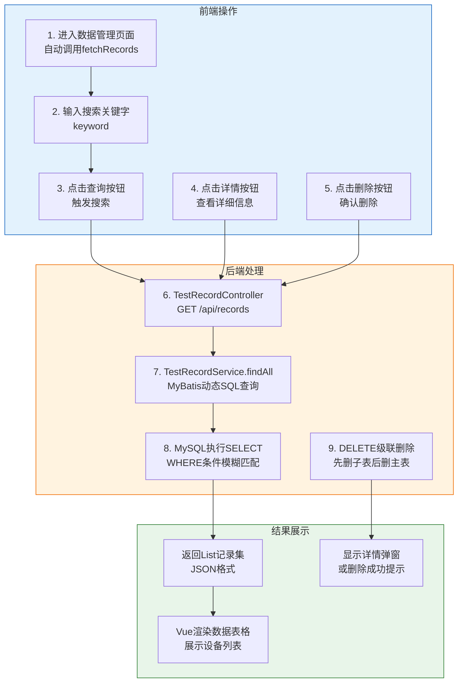

#### 前端关键代码

```javascript
// src/main/resources/static/index.html
// 数据管理视图
{
    template: `
        <div v-if="currentView === 'list'">
            <!-- 搜索工具栏 -->
            <div class="card p-3">
                <div class="row g-3">
                    <div class="col-md-4">
                        <input type="text" class="form-control" 
                               v-model="searchQuery.keyword" 
                               placeholder="输入产品编号或厂商...">
                    </div>
                    <div class="col-md-2">
                        <button class="btn btn-primary w-100" @click="fetchRecords">查询</button>
                    </div>
                </div>
            </div>

            <!-- 数据表格 -->
            <table class="table table-hover">
                <thead>
                    <tr>
                        <th>产品编号</th>
                        <th>产品名称</th>
                        <th>制造商</th>
                        <th>送检日期</th>
                        <th>产地</th>
                        <th>结论</th>
                        <th>操作</th>
                    </tr>
                </thead>
                <tbody>
                    <tr v-for="item in records" :key="item.id">
                        <td>{{ item.productNo }}</td>
                        <td>{{ item.productName }}</td>
                        <td>{{ item.manufacturer }}</td>
                        <td>{{ item.testDate }}</td>
                        <td>{{ item.origin }}</td>
                        <td>
                            <span :class="item.resultStatus === '合格' ? 'bg-success' : 'bg-danger'">
                                {{ item.resultStatus }}
                            </span>
                        </td>
                        <td>
                            <button @click="viewDetail(item)">详情</button>
                            <button @click="deleteRecord(item.id)">删除</button>
                        </td>
                    </tr>
                </tbody>
            </table>
        </div>
    `,
    data() {
        return {
            searchQuery: { keyword: '' },
            records: []
        }
    },
    methods: {
        fetchRecords() {
            axios.get('/api/records', { params: this.searchQuery })
                .then(res => {
                    if (res.data.code === 200) {
                        this.records = res.data.data;
                    }
                });
        },
        deleteRecord(id) {
            if (confirm('确认删除?')) {
                axios.delete('/api/records/' + id)
                    .then(() => this.fetchRecords());
            }
        }
    }
}
```

#### 后端关键代码

```java
// TestRecordController.java
@RestController
@RequestMapping("/api")
public class TestRecordController {
    @Autowired
    private TestRecordService testRecordService;

    // 查询所有记录，支持模糊搜索
    @GetMapping("/records")
    public Result getAllRecords(@RequestParam(required = false) String keyword) {
        List<TestRecord> list = testRecordService.findAll(keyword);
        return Result.success(list);
    }

    // 删除记录
    @DeleteMapping("/records/{id}")
    public Result delete(@PathVariable("id") Integer id) {
        testRecordService.deleteById(id);
        return Result.success();
    }
}

// TestRecordMapper.java - MyBatis动态SQL
@Mapper
public interface TestRecordMapper {
    @Select("<script>" +
            "SELECT * FROM test_records WHERE 1=1 " +
            "<if test='keyword != null and keyword != \"\"'> " +
            "AND (product_no LIKE CONCAT('%', #{keyword}, '%') " +
            "OR manufacturer LIKE CONCAT('%', #{keyword}, '%')) " +
            "</if> " +
            "ORDER BY create_time DESC" +
            "</script>")
    List<TestRecord> findAll(@Param("keyword") String keyword);

    @Delete("DELETE FROM test_records WHERE id = #{id}")
    void deleteById(Integer id);

    @Delete("DELETE FROM test_input_details WHERE record_id = #{id}")
    void deleteInputDetailsByRecordId(Integer id);

    @Delete("DELETE FROM test_phase_results WHERE record_id = #{id}")
    void deletePhaseResultsByRecordId(Integer id);
}

// TestRecordServiceImpl.java
@Service
public class TestRecordServiceImpl implements TestRecordService {
    @Autowired
    private TestRecordMapper testRecordMapper;

    @Override
    @Transactional(rollbackFor = Exception.class)
    public void deleteById(Integer id) {
        // 级联删除：先删子表，再删主表
        testRecordMapper.deletePhaseResultsByRecordId(id);
        testRecordMapper.deleteInputDetailsByRecordId(id);
        testRecordMapper.deleteById(id);
    }
}
```

#### 界面截图说明

```
┌────────────────────────────────────────────────────────────────────┐
│  数据管理                                                           │
│  ┌──────────────────────────────────────────────────────────────┐ │
│  │ [产品编号或厂商搜索框________________________] [查询]          │ │
│  └──────────────────────────────────────────────────────────────┘ │
│                                                                    │
│  ┌──────────────────────────────────────────────────────────────┐ │
│  │ 产品编号        │ 产品名称        │ 制造商   │ 送检日期 │ 结论 │ │
│  ├────────────────┼────────────────┼─────────┼──────────┼───────┤ │
│  │ ELEC-2024-0001 │ 电能表0.5S级    │ 华东电力 │2024-01-05│ 合格 │ │
│  │ ELEC-2024-0002 │ 电能表0.2S级    │ 华北科技 │2024-01-08│ 合格 │ │
│  │ ELEC-2024-0003 │ 电能表1级      │ 华南电力 │2024-01-12│ 不合格│ │
│  │ ELEC-2024-0004 │ 电能表0.5S级    │ 华东电力 │2024-01-15│ 合格 │ │
│  └────────────────┴────────────────┴─────────┴──────────┴───────┘ │
│                                                                    │
│  操作列: [详情] [删除]                                            │
│                                                                    │
│  ┌──────────────────────────────────────────────────────────────┐ │
│  │ [批量导入]  [新增记录]                                        │ │
│  └──────────────────────────────────────────────────────────────┘ │
└────────────────────────────────────────────────────────────────────┘

┌────────────────────────────────────────────────────────────────────┐
│  详情弹窗 (点击"详情"按钮后显示)                                    │
│  ┌──────────────────────────────────────────────────────────────┐ │
│  │ 🧾 测试报告详情                                          [X]   │ │
│  ├──────────────────────────────────────────────────────────────┤ │
│  │ 基础信息                                                       │ │
│  │ ┌────────────────────────────┐  ┌────────────────────────┐   │ │
│  │ │ 产品编号: ELEC-2024-0001  │  │ 产品名称: 电能表0.5S级    │   │ │
│  │ │ 制造商: 华东电力设备有限公司│  │ 产地: 上海              │   │ │
│  │ │ 测试日期: 2024-01-05     │  │ 综合判定: ✅ 合格        │   │ │
│  │ └────────────────────────────┘  └────────────────────────┘   │ │
│  ├──────────────────────────────────────────────────────────────┤ │
│  │ PT1 检测结果                                          [合格]  │ │
│  │ ┌─────┬─────┬─────┬─────┬─────┬─────┐                       │ │
│  │ │档位 │百分比│ 下限 │ 上限 │实测值│ 结论 │                       │ │
│  │ ├─────┼─────┼─────┼─────┼─────┼─────┤                       │ │
│  │ │ 1   │ 100%│-0.05│+0.05│ 0.023│ 合格│                       │ │
│  │ └─────┴─────┴─────┴─────┴─────┴─────┘                       │ │
│  │                                                           │ │
│  │ 三相误差数据                                                 │ │
│  │ ┌──────────┬─────────┬─────────┬─────────┐               │ │
│  │ │ 参数      │ A相(ao) │ B相(bo) │ C相(co) │               │ │
│  │ ├──────────┼─────────┼─────────┼─────────┤               │ │
│  │ │ f (%)    │  0.012  │  0.015  │  0.018  │               │ │
│  │ │ d (分)   │   1.5   │   2.0   │   2.3   │               │ │
│  │ │ dU (%)   │  0.018  │  0.022  │  0.025  │               │ │
│  │ │ Upt:U    │ 1.00012 │ 1.00015 │ 1.00018 │               │ │
│  │ │ Uyb:U    │ 1.00008 │ 1.00010 │ 1.00012 │               │ │
│  │ └──────────┴─────────┴─────────┴─────────┘               │ │
│  ├──────────────────────────────────────────────────────────────┤ │
│  │                                    [关闭]  [🖨 打印报告]       │ │
│  └──────────────────────────────────────────────────────────────┘ │
└────────────────────────────────────────────────────────────────────┘
```

---

### 3.3 检测数据录入模块（向导式）

#### 功能说明

检测数据录入采用3步骤向导式设计，用户依次填写基础信息 → OCR识别 → 确认提交，确保数据录入的完整性和准确性。

#### 实现逻辑

检测数据录入模块采用3步骤向导式设计，引导用户逐步完成数据录入。步骤1中，用户填写设备基本信息（产品编号、名称、制造商、产地、送检日期），并选择需要进行的检测项目（PT1、PT2、CT1、CT2等，可多选）。步骤2中，用户为每个检测项目录入详细参数，包括档位、百分比、上下限、实测值等属性，以及环境参数（二次电压，温度、湿度），同时支持上传检测设备截图进行OCR自动识别，或直接手动输入三相误差数据（ao/bo/co各相的f、d、dU、Upt:U、Uyb:U参数）。步骤3中，系统汇总展示所有录入数据供用户核对确认，确认无误后提交。提交时，前端将包含设备信息和多个检测项目的RecordDTO对象发送到后端，后端使用@Transactional注解开启事务保证数据一致性，依次保存主表记录、检测项目详情表、三相数据表，最后提交事务。

#### 处理流程图

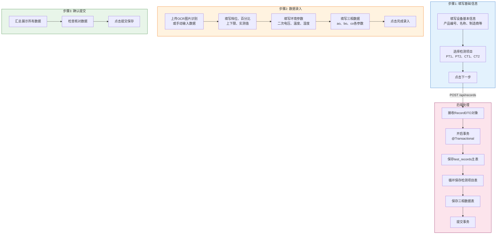

#### 前端关键代码

```javascript
// 数据录入向导 - Vue组件
{
    data() {
        return {
            wizardStep: 1,
            selectedProjects: [],
            currentProjectIndex: 0,
            formData: {
                deviceInfo: { productNo: '', productName: '', manufacturer: '', testDate: '', origin: '' },
                projects: []
            }
        }
    },
    methods: {
        // 步骤1 → 步骤2
        goToStep2() {
            // 根据选择的检测项目初始化表单数据
            this.formData.projects = this.selectedProjects.map(name => ({
                projectName: name,
                rating: '100V',
                percentage: '20%',
                min: '',
                max: '',
                measured: '',
                resultStatus: '合格',
                phaseResults: {
                    ao: { f: '', d: '', dU: '', uptU: '', uybU: '' },
                    bo: { f: '', d: '', dU: '', uptU: '', uybU: '' },
                    co: { f: '', d: '', dU: '', uptU: '', uybU: '' }
                }
            }));
            this.wizardStep = 2;
        },

        // 提交表单
        submitWizardForm() {
            axios.post('/api/records', this.formData)
                .then(res => {
                    if (res.data.code === 200) {
                        alert('保存成功！');
                        this.wizardStep = 1;
                        this.selectedProjects = [];
                        this.currentView = 'list';
                    }
                });
        }
    },
    template: `
        <div class="wizard-container">
            <!-- 步骤指示器 -->
            <div class="wizard-steps">
                <div :class="{active: wizardStep >= 1}">
                    <span>1</span> 填写基础信息
                </div>
                <div :class="{active: wizardStep >= 2}">
                    <span>2</span> OCR识别
                </div>
                <div :class="{active: wizardStep >= 3}">
                    <span>3</span> 确认提交
                </div>
            </div>

            <!-- 步骤1内容 -->
            <div v-if="wizardStep === 1">
                <!-- 设备基本信息表单 -->
                <input v-model="formData.deviceInfo.productNo" placeholder="产品编号">
                <input v-model="formData.deviceInfo.productName" placeholder="产品名称">
                <input v-model="formData.deviceInfo.manufacturer" placeholder="制造商">
                
                <!-- 检测项目选择 -->
                <div v-for="proj in ['PT1', 'PT2', 'CT1', 'CT2']">
                    <label>
                        <input type="checkbox" :value="proj" v-model="selectedProjects">
                        {{ proj }}
                    </label>
                </div>
                
                <button @click="goToStep2">下一步</button>
            </div>

            <!-- 步骤2内容 -->
            <div v-if="wizardStep === 2">
                <!-- OCR上传区域 -->
                <input type="file" @change="handleWizardImageUpload">
                
                <!-- 当前项目表单 -->
                <input v-model="formData.projects[currentProjectIndex].measured" placeholder="实测值">
                <input v-model="formData.projects[currentProjectIndex].temperature" placeholder="温度">
                
                <!-- 三相数据输入 -->
                <table>
                    <tr><th>参数</th><th>A相</th><th>B相</th><th>C相</th></tr>
                    <tr>
                        <td>f (%)</td>
                        <td><input v-model="formData.projects[currentProjectIndex].phaseResults.ao.f"></td>
                        <td><input v-model="formData.projects[currentProjectIndex].phaseResults.bo.f"></td>
                        <td><input v-model="formData.projects[currentProjectIndex].phaseResults.co.f"></td>
                    </tr>
                </table>
                
                <button @click="goToNextProject">确认并下一项</button>
            </div>

            <!-- 步骤3内容 -->
            <div v-if="wizardStep === 3">
                <!-- 汇总展示 -->
                <div v-for="proj in formData.projects">
                    {{ proj.projectName }}: {{ proj.measured }}
                </div>
                
                <button @click="submitWizardForm">提交保存</button>
            </div>
        </div>
    `
}
```

#### 后端关键代码

```java
// TestRecordServiceImpl.java - 保存检测记录
@Service
public class TestRecordServiceImpl implements TestRecordService {
    @Autowired
    private TestRecordMapper testRecordMapper;

    @Override
    @Transactional(rollbackFor = Exception.class)  // 开启事务保证数据一致性
    public void save(RecordDTO dto) {
        // 1. 保存主表 test_records
        TestRecord record = new TestRecord();
        RecordDTO.DeviceInfo info = dto.getDeviceInfo();
        
        record.setProductNo(info.productNo);
        record.setProductName(info.productName);
        record.setManufacturer(info.manufacturer);
        record.setOrigin(info.origin);
        
        if (info.testDate != null) {
            record.setTestDate(LocalDate.parse(info.testDate));
        }
        
        // 从第一个项目获取环境参数
        if (dto.getProjects() != null && !dto.getProjects().isEmpty()) {
            RecordDTO.ProjectItem first = dto.getProjects().get(0);
            record.setSecondaryVoltage(first.secondaryVoltage);
            record.setTemperature(first.temperature);
            record.setHumidity(first.humidity);
            
            // 汇总所有项目判定结果
            boolean allQualified = dto.getProjects().stream()
                .allMatch(p -> "合格".equals(p.resultStatus));
            record.setResultStatus(allQualified ? "合格" : "不合格");
        }
        
        record.setCreateTime(LocalDateTime.now());
        
        // MyBatis会自动将自增ID回填到record对象
        testRecordMapper.addRecord(record);
        Long recordId = record.getId();

        // 2. 保存检测项目 test_input_details
        if (dto.getProjects() != null) {
            for (RecordDTO.ProjectItem item : dto.getProjects()) {
                TestInputDetail detail = new TestInputDetail();
                detail.setRecordId(recordId);
                detail.setItemName(item.projectName);
                detail.setRating(item.rating);
                detail.setPercentage(item.percentage);
                detail.setMinLimit(item.min);
                detail.setMaxLimit(item.max);
                detail.setMeasuredVal(item.measured);
                detail.setSecondaryVoltage(item.secondaryVoltage);
                detail.setTemperature(item.temperature);
                detail.setHumidity(item.humidity);
                detail.setResultStatus(item.resultStatus);
                
                testRecordMapper.addInputDetail(detail);

                // 3. 保存三相数据 test_phase_results
                if (item.phaseResults != null) {
                    for (Map.Entry<String, RecordDTO.PhaseData> entry : item.phaseResults.entrySet()) {
                        TestPhaseResult phase = new TestPhaseResult();
                        phase.setRecordId(recordId);
                        phase.setItemName(item.projectName);
                        phase.setPhase(entry.getKey());  // ao/bo/co
                        
                        RecordDTO.PhaseData pd = entry.getValue();
                        phase.setFPercent(parseBigDecimal(pd.f));
                        phase.setDPercent(parseBigDecimal(pd.d));
                        phase.setDuPercent(parseBigDecimal(pd.dU));
                        phase.setUptUPercent(parseBigDecimal(pd.uptU));
                        phase.setUybUPercent(parseBigDecimal(pd.uybU));
                        
                        testRecordMapper.addPhaseResult(phase);
                    }
                }
            }
        }
    }
}
```

#### 界面截图说明

```
┌────────────────────────────────────────────────────────────────────┐
│  数据录入 - 向导                                        [退出向导]  │
│                                                                    │
│     ●──●──○                                                         │
│     1     2     3                                                   │
│  填写基础信息  OCR识别  确认提交                                      │
│                                                                    │
├────────────────────────────────────────────────────────────────────┤
│  步骤1: 填写基础信息                                                │
│                                                                    │
│  1. 被检设备基本信息                                                │
│  ┌──────────────────────────────────────────────────────────────┐ │
│  │ 产品编号*  [ELEC-2024-0100____]                              │ │
│  │ 产品名称   [电能表0.5S级______]                               │ │
│  │ 制造商    [华东电力设备有限公司]                               │ │
│  │ 产地      [上海___________]                                 │ │
│  │ 送检日期   [2024-03-30____]                                  │ │
│  └──────────────────────────────────────────────────────────────┘ │
│                                                                    │
│  2. 选择检测项目 (可多选)                                            │
│  ┌────────────┐ ┌────────────┐ ┌────────────┐ ┌────────────┐      │
│  │    PT1     │ │    PT2     │ │    CT1     │ │    CT2     │      │
│  │ 电压互感器  │ │ 电压互感器  │ │ 电流互感器  │ │ 电流互感器  │      │
│  └────────────┘ └────────────┘ └────────────┘ └────────────┘      │
│                                                                    │
│                                                    [取消] [下一步▶] │
└────────────────────────────────────────────────────────────────────┘

┌────────────────────────────────────────────────────────────────────┐
│  数据录入 - 向导                                        [退出向导]  │
│                                                                    │
│     ●──●──○                                                         │
│  填写基础信息  OCR识别  确认提交                                      │
│                                                                    │
├────────────────────────────────────────────────────────────────────┤
│  步骤2: OCR识别                                                     │
│                                                                    │
│  ┌─────────────────────────────────────────────────────────────┐  │
│  │                    📷 为 "PT1" 识别数据                       │  │
│  │                                                             │  │
│  │          [上传图片]  或  [自动识别]                          │  │
│  │                                                             │  │
│  │              支持 JPG、PNG 格式的图片识别                     │  │
│  └─────────────────────────────────────────────────────────────┘  │
│                                                                    │
│  项目属性设置                                                       │
│  ┌──────────────────────────────────────────────────────────────┐ │
│  │ 档位[1__] 百分比[100%] 下限[-0.05] 上限[+0.05] 实测值[0.023] │ │
│  └──────────────────────────────────────────────────────────────┘ │
│                                                                    │
│  环境参数                                                           │
│  ┌──────────────────────────────────────────────────────────────┐ │
│  │ 二次电压[100V]  温度(°C)[25]  湿度 (%)[60]                   │ │
│  └──────────────────────────────────────────────────────────────┘ │
│                                                                    │
│  三相误差数据                                                       │
│  ┌────────┬─────────┬─────────┬─────────┐                         │
│  │ 参数    │ A相(ao) │ B相(bo) │ C相(co) │                         │
│  ├────────┼─────────┼─────────┼─────────┤                         │
│  │ f (%)  │ [0.012] │ [0.015] │ [0.018] │                         │
│  │ d (分)  │ [ 1.5 ] │ [ 2.0 ] │ [ 2.3 ] │                         │
│  │ dU (%) │ [0.018] │ [0.022] │ [0.025] │                         │
│  │ Upt:U  │[1.00012]│[1.00015]│[1.00018]│                         │
│  │ Uyb:U  │[1.00008]│[1.00010]│[1.00012]│                         │
│  └────────┴─────────┴─────────┴─────────┘                         │
│                                                                    │
│                                                    [跳过] [完成录入] │
└────────────────────────────────────────────────────────────────────┘
```

---

### 3.4 OCR图片识别模块

#### 功能说明

OCR图片识别模块集成百度OCR API，支持从检测设备截图中自动提取计量点编号、测试日期、环境参数和三相误差数据，大幅提高数据录入效率。

#### 实现逻辑

OCR图片识别模块集成百度OCR API实现图片文字识别功能。系统支持两种识别方式：一是用户上传本地图片文件，前端将图片文件通过FormData表单形式发送到后端OcrController，后端读取文件字节流并进行Base64编码，然后携带 access_token调用百度OCR通用文字识别接口，返回识别结果JSON数据；二是从HTTP服务自动获取图片进行识别。后端接收到OCR识别文本后，使用正则表达式智能解析提取关键数据，包括计量点编号、测试日期、温度、湿度等环境参数，以及三相误差数据（f、d、dU、Upt:U、Uyb:U）。系统处理了多种OCR识别变体情况，如文字变形、全角半角字符转换、数字格式不统一等，确保数据提取的准确性。识别结果以后端返回给前端，前端自动填充到对应表单字段中供用户核对确认。

#### 处理流程图

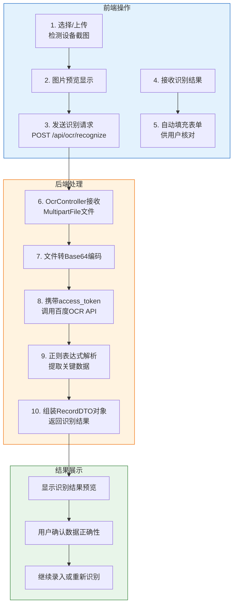

#### 前端关键代码

```javascript
// OCR识别方法
handleImageUpload(event) {
    const file = event.target.files[0];
    if (!file) return;

    // 显示图片预览
    const reader = new FileReader();
    reader.onload = (e) => {
        this.ocrPreview = e.target.result;
    };
    reader.readAsDataURL(file);

    // 上传并识别
    this.ocrLoading = true;
    const formData = new FormData();
    formData.append('file', file);

    axios.post('/api/ocr/recognize', formData, {
        headers: { 'Content-Type': 'multipart/form-data' }
    })
    .then(res => {
        this.ocrLoading = false;
        if (res.data.code === 200) {
            const data = res.data.data;
            
            // 填充设备信息
            if (data.deviceInfo) {
                Object.assign(this.formData.deviceInfo, data.deviceInfo);
            }
            
            // 填充测试结果
            if (data.testResult) {
                this.formData.testResult.secondaryVoltage = data.testResult.secondaryVoltage;
                this.formData.testResult.temperature = data.testResult.temperature;
                this.formData.testResult.humidity = data.testResult.humidity;
                
                // 填充三相数据
                if (data.testResult.phaseResults) {
                    ['ao', 'bo', 'co'].forEach(phase => {
                        if (data.testResult.phaseResults[phase]) {
                            Object.assign(
                                this.formData.testResult.phaseResults[phase],
                                data.testResult.phaseResults[phase]
                            );
                        }
                    });
                }
            }
            alert('OCR识别成功！请核对识别结果是否正确。');
        }
    });
}
```

#### 后端关键代码

```java
// OcrServiceImpl.java - OCR识别服务
@Service
public class OcrServiceImpl implements OcrService {
    private static final String API_KEY = "xhOLopUe7gj84Jyu5rUdFoHz";
    private static final String SECRET_KEY = "18CGFlE9kU0NJqatOcS1PdnXp8S5EhCg";
    private static final String OCR_URL = "https://aip.baidubce.com/rest/2.0/ocr/v1/general_basic";

    @Override
    public RecordDTO recognizeImage(MultipartFile file) throws Exception {
        // 获取AccessToken
        String accessToken = getAccessToken();

        // 文件转Base64
        byte[] imageBytes = file.getBytes();
        String imageBase64 = Base64.getEncoder().encodeToString(imageBytes);

        // 构建请求
        OkHttpClient client = new OkHttpClient();
        RequestBody body = new FormBody.Builder()
                .add("access_token", accessToken)
                .add("image", imageBase64)
                .add("language_type", "CHN_ENG")
                .build();

        Request request = new Request.Builder()
                .url(OCR_URL)
                .post(body)
                .build();

        // 发送请求
        try (Response response = client.newCall(request).execute()) {
            String responseBody = response.body().string();
            ObjectMapper mapper = new ObjectMapper();
            JsonNode rootNode = mapper.readTree(responseBody);

            // 提取文字
            StringBuilder ocrText = new StringBuilder();
            JsonNode wordsResult = rootNode.get("words_result");
            if (wordsResult != null && wordsResult.isArray()) {
                for (JsonNode wordNode : wordsResult) {
                    ocrText.append(wordNode.get("words").asText()).append("\n");
                }
            }

            // 解析OCR文本
            return parseOcrText(ocrText.toString());
        }
    }

    // 解析OCR文本，提取关键数据
    private RecordDTO parseOcrText(String text) {
        RecordDTO dto = new RecordDTO();
        RecordDTO.DeviceInfo deviceInfo = new RecordDTO.DeviceInfo();
        RecordDTO.TestResult testResult = new RecordDTO.TestResult();
        Map<String, RecordDTO.PhaseData> phaseResults = new HashMap<>();

        String combinedText = text.replace("\n", " ");

        // 提取计量点编号
        Pattern productPattern = Pattern.compile("(计量点编号|产品编号)\\s*([0-9]+)");
        Matcher productMatcher = productPattern.matcher(combinedText);
        if (productMatcher.find()) {
            deviceInfo.productNo = productMatcher.group(2);
        }

        // 提取测试日期
        Pattern datePattern = Pattern.compile("(测试日期|日期)[\\s　]*(\\d{7,8})");
        Matcher dateMatcher = datePattern.matcher(combinedText);
        if (dateMatcher.find()) {
            String dateStr = dateMatcher.group(2);
            if (dateStr.length() == 7) dateStr = "0" + dateStr;
            LocalDate date = LocalDate.parse(dateStr, DateTimeFormatter.ofPattern("yyyyMMdd"));
            deviceInfo.testDate = date.format(DateTimeFormatter.ofPattern("yyyy-MM-dd"));
        }

        // 提取温度
        Pattern tempPattern = Pattern.compile("温[\\s　]*度[\\s　]*\\d+\\.?\\d*");
        Matcher tempMatcher = tempPattern.matcher(combinedText);
        if (tempMatcher.find()) {
            Pattern numPattern = Pattern.compile("\\d+\\.?\\d*");
            Matcher numMatcher = numPattern.matcher(tempMatcher.group());
            if (numMatcher.find()) {
                testResult.temperature = numMatcher.group();
            }
        }

        // 提取三相数据
        RecordDTO.PhaseData ao = new RecordDTO.PhaseData();
        RecordDTO.PhaseData bo = new RecordDTO.PhaseData();
        RecordDTO.PhaseData co = new RecordDTO.PhaseData();

        // 匹配 f(%) 数据
        Pattern fPattern = Pattern.compile("f\\s*[（(]?\\s*[%％6]");
        Matcher fMatcher = fPattern.matcher(combinedText);
        if (fMatcher.find()) {
            Pattern numPattern = Pattern.compile("[－\\-]?\\s*\\d+\\.?\\d*");
            Matcher numMatcher = numPattern.matcher(combinedText.substring(fMatcher.end()));
            if (numMatcher.find()) ao.f = normalizeNumber(numMatcher.group());
            if (numMatcher.find()) bo.f = normalizeNumber(numMatcher.group());
            if (numMatcher.find()) co.f = normalizeNumber(numMatcher.group());
        }

        // ... 类似提取 d、dU、Upt:U、Uyb:U

        phaseResults.put("ao", ao);
        phaseResults.put("bo", bo);
        phaseResults.put("co", co);

        testResult.phaseResults = phaseResults;
        testResult.resultStatus = "合格";

        dto.setDeviceInfo(deviceInfo);
        dto.setTestResult(testResult);

        return dto;
    }
}
```

3.5 PDF报告生成模块

#### 功能说明

PDF报告生成模块使用iTextPDF库自动生成规范的中文检测报告，支持在线预览和下载打印。

#### 实现逻辑

PDF报告生成模块使用iTextPDF库自动生成规范的中文检测报告。由于PDF导出场景下无法通过请求头携带JWT Token（浏览器直接打开URL下载文件），系统采用URL参数方式传递Token。用户点击"打印报告"按钮后，前端从localStorage获取Token，将Token作为URL参数拼接到请求路径中（如/api/records/{id}/pdf?token=xxx），然后新窗口打开该URL。后端JwtAuthenticationFilter支持从URL参数中提取Token进行验证。Token验证通过后，TestRecordService查询完整的RecordDTO详情数据，包括设备基本信息、检测项目列表和三相误差数据。PDF生成时，使用iTextPDF库创建Document对象，设置支持中文的STSong-Light字体和UniGB-UCS2-H编码，按照规范格式依次添加标题、基础信息表格、检测项目数据、三相误差数据等内容，最后通过HttpServletResponse的OutputStream输出PDF文档流，浏览器接收到后自动弹出下载框或直接预览。

#### 处理流程图

```mermaid
flowchart TB
    subgraph 前端["前端操作"]
        FE1["1. 点击"打印报告"按钮"]
        FE2["2. 从localStorage<br/>获取JWT Token"]
        FE3["3. 拼接URL参数<br/>?token=xxx"]
        FE4["4. 新窗口打开URL"]
    end

    subgraph 后端["后端处理"]
        FB1["5. JwtFilter验证<br/>URL参数Token"]
        FB2["6. TestRecordController<br/>GET /api/records/{id}/pdf"]
        FB3["7. 查询RecordDTO<br/>完整详情数据"]
        FB4["8. 创建iTextPDF<br/>Document对象"]
        FB5["9. 设置中文字体<br/>STSong-Light"]
        FB6["10. 生成PDF内容<br/>标题、表格、三相数据"]
        FB7["11. OutputStream<br/>输出PDF文档流"]
    end

    subgraph 结果展示["结果展示"]
        RE1["浏览器弹出下载框"]
        RE2["保存为PDF文件"]
        RE3["PDF阅读器预览/打印"]
    end

    FE1 --> FE2 --> FE3 --> FE4
    FE4 --> FB1 --> FB2 --> FB3 --> FB4 --> FB5 --> FB6 --> FB7
    FB7 --> RE1 --> RE2 --> RE3

    style 前端 fill:#e3f2fd,stroke:#1565c0
    style 后端 fill:#fff3e0,stroke:#ef6c00
    style 结果展示 fill:#e8f5e9,stroke:#2e7d3
```

## Q4: 模块五 - 安全设计

### 问题描述

> 详细说明系统安全设计，包括前后端分离架构、通信协议、接口统一格式、Token认证机制等

### 解答

### 5.1 前后端分离架构与技术栈

#### 技术栈说明

二次压降检测系统采用**前后端完全分离**的B/S架构，前端负责页面展示和用户交互，后端提供RESTful API服务。这种架构使得前端和后端可以独立开发、测试和部署，提高了开发效率和系统可维护性。

#### 技术选型

| 层级           | 技术                      | 说明                                     |
| -------------- | ------------------------- | ---------------------------------------- |
| **前端**       | HTML5 + CSS3 + JavaScript | 基础Web技术                              |
| **前端框架**   | Vue.js 3                  | 渐进式JavaScript框架，实现响应式数据绑定 |
| **UI组件**     | Bootstrap 5               | 响应式UI组件库                           |
| **HTTP客户端** | Axios                     | Promise-based HTTP客户端                 |
| **图表库**     | ECharts 5.4.3             | 数据可视化图表                           |
| **后端框架**   | Spring Boot 3.4.12        | 基于Spring Framework的快速开发框架       |
| **安全框架**   | Spring Security           | 认证和授权框架                           |
| **认证机制**   | JWT (jjwt 0.12.6)         | 无状态JSON Web Token                     |
| **密码加密**   | BCrypt                    | 强哈希算法                               |
| **持久层**     | MyBatis 3.0.5             | 对象关系映射(ORM)框架                    |
| **数据库**     | MySQL 8.0                 | 关系型数据库                             |

```meri
#### 前后端分离架构图

​```mermaid
flowchart TB
    subgraph 前端["前端 (Static Files)"]
        FE_HTML["HTML页面<br/>login.html<br/>index.html"]
        FE_VUE["Vue.js 3<br/>数据绑定"]
        FE_AXIOS["Axios<br/>HTTP请求"]
        FE_LOCAL["localStorage<br/>Token存储"]
    end

    subgraph 通信["HTTP通信层"]
        HTTPS["HTTPS<br/>SSL/TLS加密"]
        CORS["CORS<br/>跨域资源共享"]
        REST["RESTful API<br/>JSON数据格式"]
    end

    subgraph 后端["后端 (Spring Boot)"]
        BE_CTRL["Controller层<br/>@RestController"]
        BE_SVC["Service层<br/>@Service"]
        BE_MAPPER["Mapper层<br/>@Mapper"]
        BE_SEC["Spring Security<br/>安全配置"]
        BE_JWT["JWT Filter<br/>Token过滤器"]
    end

    subgraph 数据层["数据持久层"]
        DB["MySQL 8.0<br/>数据库"]
    end

    FE_HTML --> FE_VUE --> FE_AXIOS
    FE_AXIOS -->|"HTTP Request| HTTPS
    HTTPS -->|"JSON Request| CORS --> REST
    REST --> BE_CTRL --> BE_SVC --> BE_MAPPER --> DB
    
    BE_JWT -->|"Token验证| BE_SEC
    FE_LOCAL -->|"携带Token| FE_AXIOS

    style 前端 fill:#e3f2fd,stroke:#1565c0,stroke-width:2px
    style 通信 fill:#fff3e0,stroke:#ef6c00,stroke-width:2px
    style 后端 fill:#e8f5e9,stroke:#2e7d32,stroke-width:2px
    style 数据层 fill:#fce4ec,stroke:#880e4f,stroke-width:2px
```

---

### 5.2 通信协议与接口规范

#### 通信协议

系统采用**HTTP/HTTPS协议**进行前后端通信，支持JSON格式的数据交换。前端通过Axios库发起异步HTTP请求，后端Spring Boot通过@RestController注解的API接口接收请求并返回JSON响应。

#### 请求格式

```javascript
// 标准请求格式
axios({
    method: 'POST',           // 请求方法：GET/POST/PUT/DELETE
    url: '/api/auth/login',   // 请求URL
    headers: {                // 请求头
        'Content-Type': 'application/json',
        'Authorization': 'Bearer ' + token  // JWT Token
    },
    data: {                   // 请求体（JSON格式）
        username: 'admin',
        password: 'admin123'
    },
    params: {                  // URL查询参数
        keyword: 'search'
    }
})
```

#### 响应格式（Result统一封装）

```java
// 后端统一响应封装 - Result.java
public class Result<T> {
    private Integer code;      // 状态码：200成功，400/401/500等
    private String message;  // 响应消息
    private T data;           // 响应数据

    // 成功响应
    public static <T> Result<T> success(T data) {
        Result<T> result = new Result<>();
        result.setCode(200);
        result.setMessage("操作成功");
        result.setData(data);
        return result;
    }

    // 失败响应
    public static <T> Result<T> error(String message) {
        Result<T> result = new Result<>();
        result.setCode(500);
        result.setMessage(message);
        return result;
    }
}
```

#### 标准响应示例

```json
// 成功响应
{
    "code": 200,
    "message": "操作成功",
    "data": {
        "id": 1,
        "username": "admin",
        "nickname": "系统管理员",
        "role": "ADMIN"
    }
}

// 失败响应
{
    "code": 401,
    "message": "用户不存在或密码错误",
    "data": null
}

// 错误响应
{
    "code": 500,
    "message": "服务器内部错误",
    "data": null
}
```

#### HTTP状态码说明

| 状态码 | 含义 | 说明 |
|--------|------|------|
| **200** | OK | 请求成功，常用于GET/POST成功 |
| **201** | Created | 资源创建成功 |
| **400** | Bad Request | 请求参数错误 |
| **401** | Unauthorized | 未认证，Token无效或过期 |
| **403** | Forbidden | 无权限，角色不允许 |
| **404** | Not Found | 资源不存在 |
| **500** | Internal Server Error | 服务器内部错误 |

#### 接口统一格式流程图

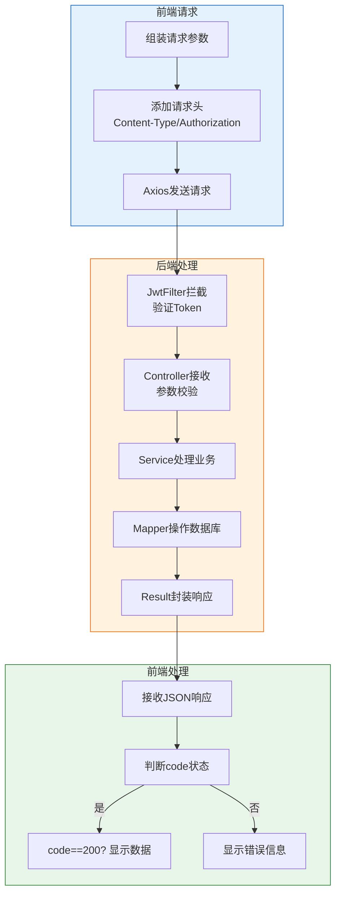

---

### 5.3 认证授权流程详解

#### 完整认证流程：登录 → 鉴权 → 校验 → 异常处理

系统采用**JWT (JSON Web Token)**实现无状态的认证授权机制，整个认证流程包括以下环节：

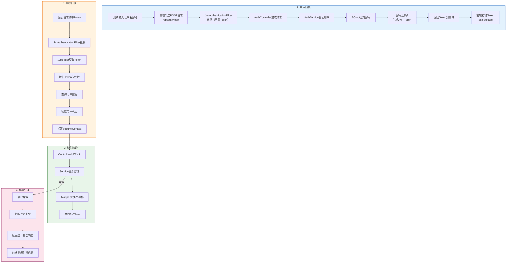

---

### 5.4 Token机制详解

#### Token生成

当用户登录成功后，后端AuthService使用JWT Utils生成包含用户信息的Token：

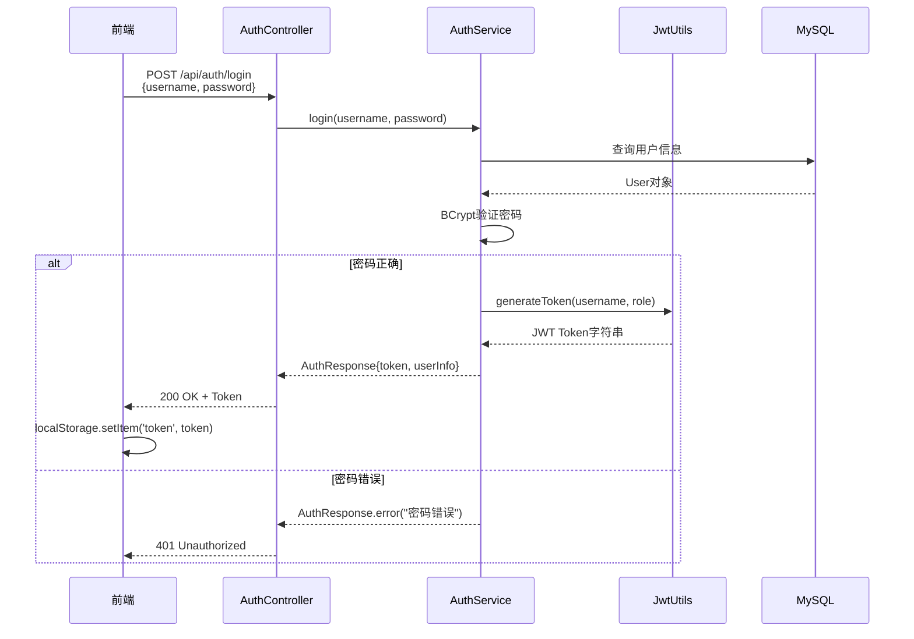

#### Token存储

| 存储位置 | 存储内容 | 有效期 | 特点 |
|----------|----------|--------|------|
| **localStorage** | JWT Token字符串 | 与Token有效期一致 | 页面关闭仍保留，需手动清除 |
| **Cookie** | 可选 | 可设置 | 可设置HttpOnly提高安全性 |
| **SessionStorage** | 可选 | 页面关闭清除 | 更安全但不支持跨页签 |

#### Token携带方式

系统支持两种Token携带方式：

**方式一：请求头携带（推荐）**

```javascript
// Axios请求拦截器自动添加
axios.interceptors.request.use(config => {
    const token = localStorage.getItem('token');
    if (token) {
        config.headers.Authorization = 'Bearer ' + token;
    }
    return config;
});
```

**方式二：URL参数携带（用于特殊场景如PDF下载）**

```javascript
// PDF导出等无法通过请求头携带Token的场景
const url = '/api/records/' + id + '/pdf?token=' + encodeURIComponent(token);
window.open(url, '_blank');
```

#### Token校验流程

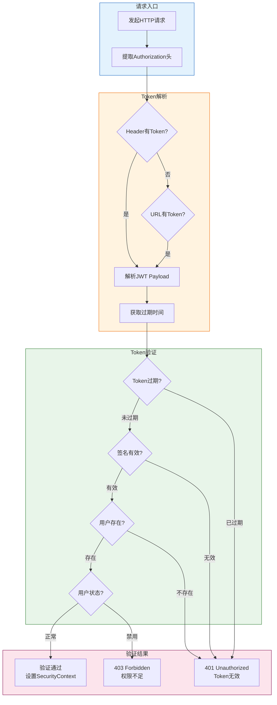

#### Token关键代码

```java
// JwtUtils.java - Token生成与验证
public class JwtUtils {
    private static final long EXPIRATION = 86400000; // 24小时

    // 生成Token
    public static String generateToken(String username, String role) {
        Date now = new Date();
        Date expiration = new Date(now.getTime() + EXPIRATION);

        return Jwts.builder()
                .setSubject(username)
                .claim("role", role)
                .setIssuedAt(now)
                .setExpiration(expiration)
                .signWith(key, SignatureAlgorithm.HS256)
                .compact();
    }

    // 验证Token
    public static boolean validateToken(String token) {
        try {
            Jwts.parserBuilder()
                .setSigningKey(key)
                .build()
                .parseClaimsJws(token);
            return true;
        } catch (JwtException e) {
            return false;
        }
    }

    // 获取用户名
    public static String getUsernameFromToken(String token) {
        Claims claims = Jwts.parserBuilder()
                .setSigningKey(key)
                .build()
                .parseClaimsJws(token)
                .getBody();
        return claims.getSubject();
    }
}

// JwtAuthenticationFilter.java - Token过滤器
@Component
public class JwtAuthenticationFilter extends OncePerRequestFilter {
    @Override
    protected void doFilterInternal(HttpServletRequest request,
                                    HttpServletResponse response,
                                    FilterChain filterChain) {
        String authHeader = request.getHeader("Authorization");

        // 优先从Header获取
        if (authHeader != null && authHeader.startsWith("Bearer ")) {
            String token = authHeader.substring(7);
            validateAndSetContext(token);
        } else {
            // 从URL参数获取（支持PDF导出场景）
            String tokenParam = request.getParameter("token");
            if (tokenParam != null) {
                validateAndSetContext(URLDecoder.decode(tokenParam, StandardCharsets.UTF_8));
            }
        }

        filterChain.doFilter(request, response);
    }

    private void validateAndSetContext(String token) {
        if (jwtUtils.validateToken(token)) {
            String username = jwtUtils.getUsernameFromToken(token);
            User user = userMapper.findByUsername(username);

            if (user != null && user.getStatus() == 1) {
                UsernamePasswordAuthenticationToken authentication =
                    new UsernamePasswordAuthenticationToken(
                        user, null,
                        Collections.singletonList(new SimpleGrantedAuthority("ROLE_" + user.getRole()))
                    );
                SecurityContextHolder.getContext().setAuthentication(authentication);
            }
        }
    }
}
```

---

### 5.5 异常处理机制

#### 统一异常处理流程

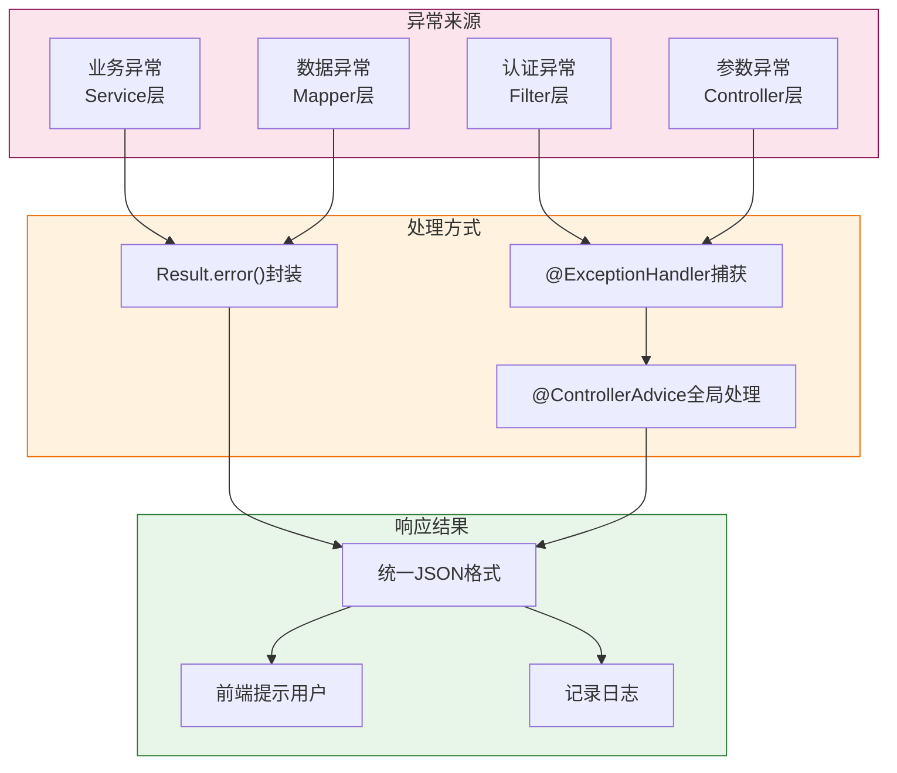

#### 异常类型与处理

| 异常类型 | 状态码 | 处理方式 | 示例 |
|----------|--------|----------|------|
| **用户不存在** | 401 | AuthService返回Result.error() | 用户名输入错误 |
| **密码错误** | 401 | AuthService返回Result.error() | 密码不正确 |
| **Token过期** | 401 | JwtFilter返回错误JSON | Token超过24小时 |
| **Token无效** | 401 | JwtFilter返回错误JSON | Token被篡改 |
| **权限不足** | 403 | Spring Security拦截 | 普通用户访问管理员接口 |
| **资源不存在** | 404 | Controller返回Result.error() | 查询不存在的记录 |
| **参数错误** | 400 | 参数校验失败 | 必填字段为空 |
| **服务器错误** | 500 | 全局异常处理器 | 数据库连接失败 |

#### 异常处理代码示例

```java
// AuthService.java - 业务异常处理
public AuthResponse login(LoginRequest request) {
    User user = userMapper.findByUsername(request.getUsername());

    if (user == null) {
        return AuthResponse.error("用户不存在");
    }

    if (user.getStatus() != 1) {
        return AuthResponse.error("账号已被禁用");
    }

    if (!passwordEncoder.matches(request.getPassword(), user.getPassword())) {
        return AuthResponse.error("密码错误");
    }

    String token = jwtUtils.generateToken(user.getUsername(), user.getRole());
    return AuthResponse.success(token, user.getUsername(),
                               user.getNickname(), user.getRole());
}

// AuthController.java - 控制器
@PostMapping("/login")
public Result<AuthResponse> login(@RequestBody LoginRequest request) {
    if (request.getUsername() == null || request.getUsername().trim().isEmpty()) {
        return Result.error("用户名不能为空");
    }
    if (request.getPassword() == null || request.getPassword().trim().isEmpty()) {
        return Result.error("密码不能为空");
    }

    AuthResponse response = authService.login(request);
    if (response.getToken() != null) {
        return Result.success(response);
    } else {
        return Result.error(response.getMessage());
    }
}
```

---

### 5.6 安全性最佳实践

#### 本项目采用的安全措施

| 安全措施 | 实现方式 | 说明 |
|----------|----------|------|
| **密码加密** | BCrypt算法 | 单向哈希，不可逆 |
| **Token认证** | JWT | 无状态认证 |
| **HTTPS** | SSL/TLS | 生产环境启用 |
| **CORS配置** | 限制允许的域 | 防止跨站请求 |
| **参数校验** | @Valid注解 | 后端参数校验 |
| **SQL注入防护** | MyBatis参数化查询 | 防止SQL注入 |
| **XSS防护** | Spring Security配置 | 防止跨站脚本攻击 |
| **CSRF防护** | JWT无状态认证 | 禁用CSRF Token |

#### 密码安全

```java
// 密码加密存储 - 注册时
public void register(User user) {
    // 使用BCrypt加密密码
    String encryptedPassword = passwordEncoder.encode(user.getPassword());
    user.setPassword(encryptedPassword);
    userMapper.insert(user);
}

// 密码验证 - 登录时
public boolean verifyPassword(String rawPassword, String encryptedPassword) {
    return passwordEncoder.matches(rawPassword, encryptedPassword);
}
```

---

### 5.7 安全设计总结

#### 核心安全机制

二次压降检测系统的安全设计围绕**认证(Authentication)**和**授权(Authorization)**两大核心展开：

1. **认证机制**：采用JWT无状态Token认证，用户登录成功后生成包含用户名和角色的Token，前端每次请求携带Token进行身份验证。

2. **授权机制**：通过Spring Security的基于角色的访问控制(RBAC)，区分USER和ADMIN角色，对不同角色的用户开放不同的API接口权限。

3. **密码安全**：使用BCrypt强哈希算法对密码进行加密存储，即使数据库泄露也无法获取用户明文密码。

4. **异常处理**：统一的异常处理机制确保所有错误都以标准JSON格式返回，便于前端统一处理和用户提示。

#### 安全流程总览

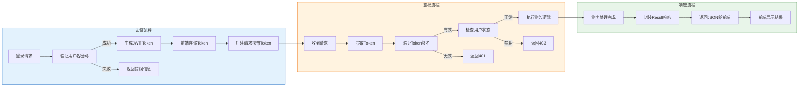

---

## 持续更新中...

> 后续的问题和答案将继续添加在此文档中。

---

## 贡献指南

欢迎提交新的问题和解答！请遵循以下格式：

```markdown
## Q?: 问题标题

### 问题描述
> 简要描述遇到的问题

### 解答
详细的解答内容，包括代码示例、图表等
```

---

**最后更新**: 2026-04-23
**版本**: v1.1
**维护者**: 项目开发团队